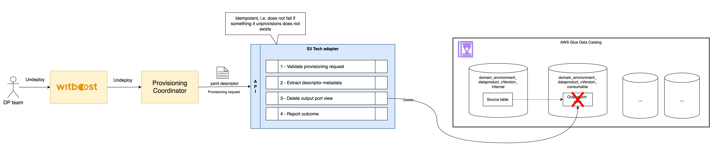

# High Level Design

This document describes the High Level Design of the Athena Tech Adapter.
The source diagrams can be found and edited in the [accompanying draw.io file](hld.drawio).

- [Overview](#overview)
- [Provisioning](#provisioning)
- [Unprovisioning](#unprovisioning)

## Overview

### Tech Adapter

A Tech Adapter (TA) is a service in charge of performing a resource allocation task, usually
through a Cloud Provider. The resources to allocate are typically referred to as the _Component_, the
details of which are described in a YAML file, known as _Component Descriptor_.

The TA is invoked by an upstream service of the Witboost platform, namely the Coordinator, which is in charge of orchestrating the creation
of a complex infrastructure by coordinating several TAs in a single workflow. The TA receives
the _Data Product Descriptor_ as input with all the components (because it might need more context) plus the id of the component to provision, named _componentIdToProvision_

To enable the above orchestration a TA exposes an API made up of five main operations:
- validate: checks if the provided component descriptor is valid and reports any errors
- provision: allocates resources based on the previously validated descriptor; clients either receive an immediate response (synchronous) or a token to monitor the provisioning process (asynchronous)
- status: for asynchronous provisioning, provides the current status of a provisioning request using the provided token
- unprovision: destroys the resources previously allocated.
- updateacl: grants access to a specific component/resource to a list of users/groups

### Athena Tech Adapter

The **Athena Tech Adapter** provides integration with Amazon Athena to manage data provisioning operations. It focuses on the creation of Athena views.

---

## Provisioning

This flow enables the creation of Athena views.

The main operations executed are:
- Validation:
  - Component extraction and parsing
  - Source table existence check: 
    1. if it exists, the conformity between data contract schema and table schema is checked
    2. if it does not exist, validation will only succeed if a data contract schema has been provided (which will be used to create the table)
- Database creation (internal and/or consumable) if not present in the AWS catalog 
- Creation of source table if it does not exist
- Creation or updating of the view: the process checks whether the source table has Lake Formation permissions granted to `IAMAllowedPrincipals`
    - If **yes**, a **VIEW** is created, and its permissions are expected to be managed via IAM.
    - If **no**, the location of the source table is registered in Lake Formation enabling hybrid access mode. The view is created as a **MULTI-DIALECT VIEW**, and its permissions will be managed through AWS Lake Formation. Please refer to the [official documentation](https://docs.aws.amazon.com/athena/latest/ug/views-glue.html) for more information about multi dialect views.
- Permission management according to configuration (to be implemented)

## Unprovisioning

This flow allows to delete the view created in the provisioning step.

After a simple parsing of the request, the view is deleted. The operation is idempotent and will not fail if a request is made to delete a view that does not exist.

